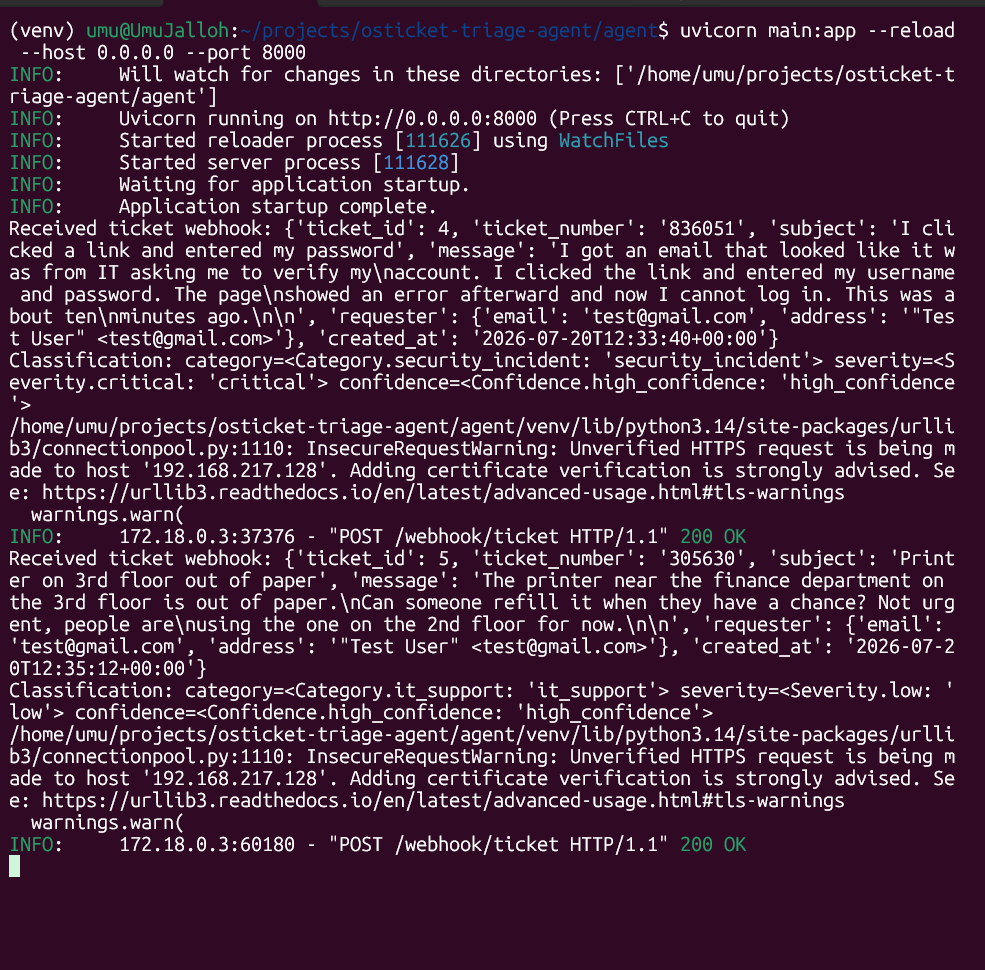
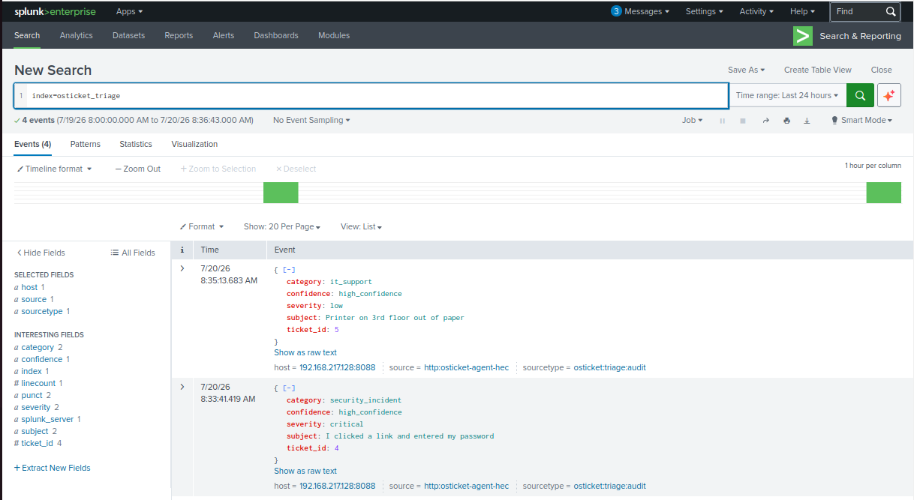

# osTicket AI Triage Agent

An AI triage layer for osTicket helpdesk tickets. Classifies incoming tickets
for security relevance, enriches them with Splunk data, and routes them to the
right place. Real security incidents stop getting buried in helpdesk noise.

## Status

Phase 1 complete: tickets are received over an authenticated webhook,
classified, and written to a Splunk audit log. No writes back to osTicket yet.
Enrichment is Phase 2, notes and alerting are Phase 3.

See [docs/architecture.md](docs/architecture.md) for the full design and
[docs/KNOWN_LIMITATIONS.md](docs/KNOWN_LIMITATIONS.md) for evaluation findings.

## Why this exists

Helpdesk queues mix routine IT requests with early signals of real security
incidents. A compromised account or a phishing report can sit unread behind
printer tickets. This agent triages every ticket as it arrives, flags the
security-relevant ones, and enriches them with context from the SIEM before a
human ever looks.

## How Phase 1 works

A user submits a ticket in osTicket. The
[plugin](osticket-plugin/class.TriagePlugin.php) fires on ticket creation, signs
the payload with HMAC-SHA256, and POSTs it to the agent.
[`main.py`](agent/main.py) verifies the signature against the raw request body
and rejects anything that fails.

[`classifier.py`](agent/classifier.py) sends the ticket text to Claude as
user-role content wrapped in delimiters, with the classification instructions in
the system role. Claude returns a category, severity, and confidence,
constrained by a tool schema and validated against the Pydantic model in
[`schemas.py`](agent/schemas.py). [`splunk_logger.py`](agent/splunk_logger.py)
writes the result to Splunk over HEC.

If Claude fails to return a classification, rate limited, unreachable, a bad
credential, or an invalid response, the agent routes the ticket to a human and
logs the specific failure type to Splunk instead of guessing at a
classification. The full breakdown is in
[docs/architecture.md](docs/architecture.md#6-failure-modes-for-the-claude-dependency).

Claude only ever produces a label. Every action the agent takes comes from a
fixed table in code ([docs/action-table.md](docs/action-table.md)), so a
manipulated classification cannot trigger an action that was not pre-approved.

## Example

Two tickets submitted through osTicket, a reported phishing click and a printer
out of paper, classified and audited:





## Repository layout

```
agent/              FastAPI service: webhook receiver, classifier, audit logger
docker/             Dockerfile and compose file for the osTicket and Splunk environment
docs/               Architecture, action table, known limitations
osticket-plugin/    osTicket plugin that fires the webhook
tests/              Evaluation ticket set
```

## Setup

### Prerequisites

- Docker and Docker Compose
- Python 3.11 or newer (developed and tested on 3.14)
- An Anthropic API key

### 1. osTicket environment

```bash
cd docker
cp .env.example .env
```

Edit `docker/.env` and set your own database credentials. These exact values
are used again during the osTicket installer, so keep them to hand.

The Dockerfile removes osTicket's `setup/` directory, which is a live
installer page and a liability once osTicket is installed. That directory has
to exist for the first install, so the first build is done with that line
commented out.

Comment out this two-line instruction in [docker/Dockerfile](docker/Dockerfile),
the one that removes `setup/` and chowns the plugin directory:

```dockerfile
# RUN rm -rf /var/www/html/setup \
#     && chown -R www-data:www-data /var/www/html/include/plugins/triage-webhook
```

Then build and start:

```bash
docker compose up -d --build
```

Open `http://localhost:8080` and run the installer. Use `db` as the MySQL
hostname, since that is the service name on the Docker network. The database
name, user, and password must match what you set in `docker/.env`.

Once the installer finishes, uncomment both lines and rebuild:

```bash
docker compose up -d --build
```

`ost-config.php` holds the database credentials and osTicket's secret salt, so
it is not committed. Each install generates its own.

### 2. Plugin configuration

The plugin files are copied into the image by the Dockerfile, so osTicket will
already see the plugin. The instance still has to be created by hand.

Generate a shared secret. Python's standard library covers this, no project
setup needed yet:

```bash
python3 -c "import secrets; print(secrets.token_hex(32))"
```

Save the output, this value goes into `agent/.env` in Section 4 as well.

Log into the staff panel at `http://localhost:8080/scp`, then Manage →
Plugins. Open AI Triage Webhook and set it to Active. Add an instance, give it
a name, set its status to Active, and on the Config tab set:

- FastAPI Webhook URL: `http://host.docker.internal:8000/webhook/ticket`
- HMAC Shared Secret: the value you just generated

The container reaches the agent through `host.docker.internal`, which resolves
via the `extra_hosts` entry in
[docker-compose.yml](docker/docker-compose.yml). The agent must be listening
on port 8000 on the host.

### 3. Splunk

Splunk runs as part of the same Docker Compose stack and already started in
Section 1. Add `SPLUNK_PASSWORD` to `docker/.env` (8 or more characters,
mixing letters and numbers, Splunk rejects overly simple passwords even at
8 characters) before running `docker compose up -d --build`.

Splunk's web UI is at `http://localhost:8010`, mapped from the container's
internal port 8000 since port 8000 is already used by the agent. Log in with
`admin` and the password you set.

Create an index named `osticket_triage`.

Confirm HEC is enabled globally: Settings → Data Inputs → HTTP Event Collector
→ Global Settings, All Tokens should show Enabled. This is usually already on
by default, but worth checking before creating a token.

Create an HEC token with the `osticket_triage` index in its allowed list. The
agent sends events with sourcetype `osticket:triage:audit`. Splunk shows the
token value once, at creation, save it now, this value goes into `agent/.env`
in Section 4.

Splunk must be running when the agent processes a ticket. If it is not, the
audit write fails and the agent logs the failure but still returns the
classification, so a missing audit entry will not surface as an error in the
agent's output.

The agent connects with certificate verification disabled, since a default
Splunk install uses a self-signed certificate. See
[`splunk_logger.py`](agent/splunk_logger.py).

### 4. Agent environment

```bash
cd agent
python3 -m venv venv
source venv/bin/activate
pip install -r requirements.txt
```

Create `agent/.env`:

```
ANTHROPIC_API_KEY=your-key
TRIAGE_HMAC_SECRET=the-secret-you-generated-in-section-2
SPLUNK_HEC_URL=https://localhost:8088/services/collector/event
SPLUNK_HEC_TOKEN=the-token-you-created-in-section-3
```

### 5. Run the agent

```bash
cd agent
source venv/bin/activate
uvicorn main:app --reload --host 0.0.0.0 --port 8000
```

Submit a ticket at `http://localhost:8080`. The classification appears in the
agent's output and in Splunk under `index=osticket_triage`.

## Evaluation

The classifier is evaluated against 30 hand-written tickets with expected
labels in [tests/eval_tickets.json](tests/eval_tickets.json):

```bash
cd agent
source venv/bin/activate
python3 run_eval.py
```

[`run_eval.py`](agent/run_eval.py) sends each ticket's subject and message to
the classifier and compares the result against the expected label. Expected
labels are never sent to the model.

Accuracy range and known failure modes are in
[docs/KNOWN_LIMITATIONS.md](docs/KNOWN_LIMITATIONS.md).
