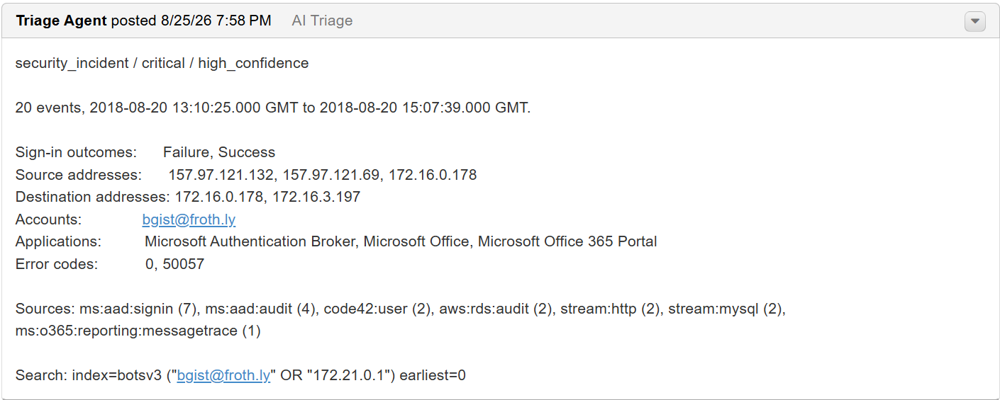
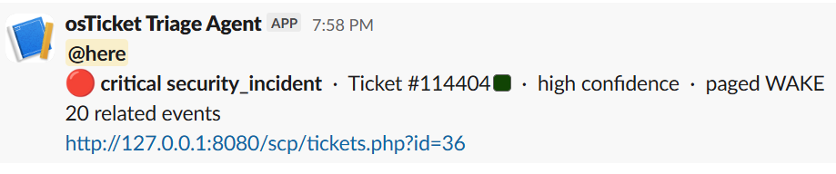
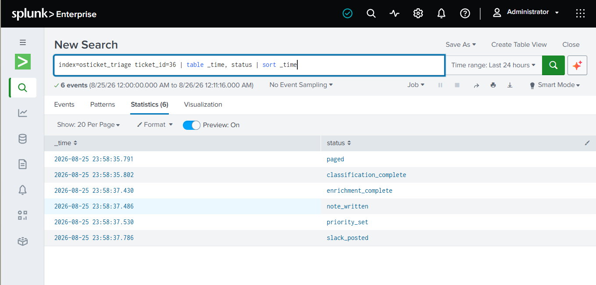

# osTicket AI Triage Agent

An AI triage layer for osTicket helpdesk tickets. Classifies incoming tickets
for security relevance, enriches them with Splunk data, and routes them to the
right place. Real security incidents stop getting buried in helpdesk noise.

## Status

All three phases built. Tickets are received over an authenticated webhook,
classified, enriched with Splunk context when the gate matches, and written to a
Splunk audit log. The agent writes an internal note back to osTicket, sets the
ticket priority, routes security questions to a security department, posts to
one of three Slack channels, and pages PagerDuty on every critical incident.

Delivery survives the agent being down. A send osTicket cannot complete is
queued and retried on cron and on the next ticket created, and a run the agent
was interrupted partway through is resumed on the decision it already made
rather than reclassified. After an hour of failing to deliver, the plugin gives
up and says so on the ticket, so nothing waits silently on something that is
not coming.

A ticket the agent accepted and then crashed on is finished on restart. The
webhook answers before the work runs, so osTicket counts that ticket as
delivered and never sends it again. Nothing outside the agent can recover it.
Tickets older than an hour are handed to a person instead of acted on late.

The agent reports liveness to Splunk every minute. Saved searches in the repo
alert by email when those reports stop, and when pages or Slack posts keep
failing to the same destination. Splunk has to be running for either, which is
why watching the audit index is still a deployment precondition.

See [docs/architecture.md](docs/architecture.md) for the design and threat
model, [docs/evaluation.md](docs/evaluation.md) for how the classifier is
measured and what it currently scores,
[docs/verification.md](docs/verification.md) for what the built system was
checked to do, and [docs/known-limitations.md](docs/known-limitations.md) for
what it cannot do.

## Why this exists

Helpdesk queues mix routine IT requests with early signals of real security
incidents. A compromised account or a phishing report can sit unread behind
printer tickets. This agent triages every ticket as it arrives, flags the
security-relevant ones, and enriches them with context from the SIEM before a
human ever looks.

## How it works

A user submits a ticket in osTicket. The
[plugin](osticket-plugin/class.TriagePlugin.php) fires on ticket creation, signs
the payload with HMAC-SHA256, and POSTs it to the agent.
[`main.py`](agent/main.py) verifies the signature against the raw request body
and rejects anything that fails.

[`classifier.py`](agent/classifier.py) sends the ticket text to Claude as
user-role content wrapped in delimiters, with the classification instructions in
the system role. Claude returns a category, severity, and confidence,
constrained by a tool schema and validated against the Pydantic model in
[`schemas.py`](agent/schemas.py). [`splunk_logger.py`](agent/splunk_logger.py)
writes the result to Splunk over HEC.

When a ticket lands on `security_incident` at `critical` severity,
[`splunk_enrichment.py`](agent/splunk_enrichment.py) searches Splunk for related
events. Confidence does not gate this, because the tickets that read as
uncertain are the ones a reviewer most needs context for.

It searches on the submitter's IP, which the server observes, and on the
requester email only when osTicket reports the ticket was filed from an
authenticated session for that address. On an open ticket form the email is
whatever the submitter typed, so an unverified one is a search target the
submitter picked and never reaches a query. Any hostname, username, or IP the
classifier extracted from the ticket text is treated the same way: validated and
recorded in the audit log, never searched for. Every value is validated against a
strict pattern inside the enrichment module before it can reach a query,
independent of whether the caller already validated it.

Queries are built from fixed templates, run read-only, authenticate as a Splunk
user scoped to a single index, and return a named field list rather than raw
events, so credentials sitting in raw log text never enter the audit index. The
result, or the reason there wasn't one, goes to the audit log either way.

Claude only ever produces a label. Every action the agent takes comes from
[`action_table.py`](agent/action_table.py), a fixed table of ten rows documented
in [docs/action-table.md](docs/action-table.md), so a manipulated classification
cannot trigger an action that was not pre-approved.

[`note_builder.py`](agent/note_builder.py) builds the internal note, carrying the
enrichment result when there was one.
[`osticket_client.py`](agent/osticket_client.py) writes it back, sets the ticket
priority from the severity, and moves security questions to the security
department. It writes through
[`class.TriageWriteController.php`](osticket-plugin/class.TriageWriteController.php),
an endpoint the plugin registers, because osTicket's stock API can create a
ticket and trigger cron and nothing else. The note is an internal thread entry,
so the person who filed the ticket never sees it.

[`slack_client.py`](agent/slack_client.py) posts the alert to one of three
channels, `urgent` for critical security incidents, `incidents` for the high,
medium and low ones, and `review` for `unclear` tickets and the security
questions and IT requests it was not confident about.
[`pagerduty_client.py`](agent/pagerduty_client.py) pages one of two services,
WAKE to interrupt someone and NOTIFY to create an incident somebody owns without
waking them. Neither module chooses where its message goes. The channel and the
page destination are columns of the action table, selected the same way the note
and the priority are.

On a critical security incident the page goes out immediately, ahead of
enrichment and any audit write. Both of those talk to Splunk, and a Splunk that
hangs rather than refuses would otherwise hold the page for around two and a half
minutes.

Two modules sit between a decision and a write.
[`idempotency.py`](agent/idempotency.py) records every completed action in a
SQLite store that survives a restart, so a retried webhook cannot write a second
note or send a second page. [`writes.py`](agent/writes.py) reads `ENABLE_WRITES`
once at import and exposes the single check every write path calls. It has no
default and accepts only `true` or `false`, so a misspelled value stops the agent
at boot instead of reading as off. Audit logging is never disabled by it.

If Claude fails to return a classification, rate limited, unreachable, a bad
credential, or an invalid response, the agent flags the ticket for human review
and logs the specific failure type to Splunk instead of guessing at a
classification. Flagging means a post to the review channel naming the ticket
and the failure, which is all the agent can do with no classification to work
from. When the audit write fails instead, the classification stands but nothing
outside Splunk records how it was reached, so the agent writes that gap onto
the ticket note. The full breakdown is in
[docs/architecture.md](docs/architecture.md#6-failure-modes-for-the-claude-dependency).

## Example

One ticket, submitted through the osTicket form by a signed-in user reporting an
account they could not lock an intruder out of. It classified
`security_incident / critical / high_confidence`, which writes a note, sets
priority, alerts the urgent channel with a mention, and pages someone awake.

The internal note it wrote on the ticket, invisible to the person who filed it,
carries twenty related events and the query that produced them. That query is
built only from values the server could verify, never from the ticket text.



The alert to the urgent Slack channel carries no ticket subject, no requester
address and no enrichment detail, because none of those may leave the trust zone.



The audit index records every step, with the page landing first, ahead of
enrichment and ahead of the audit writes.



Method and full results for the runs behind these, including the authentication
gate pair, are in [docs/verification.md](docs/verification.md).

## Repository layout

```
agent/              FastAPI service: webhook receiver, classifier, enrichment, actions, audit logger
agent/verification/ 10 verifiers, 265 checks, each reproducible from one command
docker/             Dockerfile, compose file, and Splunk provisioning for the environment
docs/               Architecture, action table, evaluation, verification, known limitations
osticket-plugin/    osTicket plugin that fires the webhook and receives write-backs
tests/              Evaluation ticket set
```

## Setup

### Prerequisites

- Docker and Docker Compose
- Python 3.11 or newer (developed and tested on 3.14)
- An Anthropic API key

### 1. osTicket environment

```bash
cd docker
cp .env.example .env
```

Edit `docker/.env` and set your own database credentials. These exact values
are used again during the osTicket installer, so keep them to hand.

The Dockerfile removes osTicket's `setup/` directory, which is a live
installer page and a liability once osTicket is installed. That directory has
to exist for the first install, so the first build is done with that line
commented out.

Comment out this two-line instruction in [docker/Dockerfile](docker/Dockerfile),
the one that removes `setup/` and chowns the plugin directory:

```dockerfile
# RUN rm -rf /var/www/html/setup \
#     && chown -R www-data:www-data /var/www/html/include/plugins/triage-webhook
```

Then build the image and create the config file:

```bash
docker compose build osticket
docker compose run --rm --no-deps --entrypoint cat osticket \
  /var/www/html/include/ost-sampleconfig.php > ost-config.php
chmod 0666 ost-config.php
```

[docker/docker-compose.yml](docker/docker-compose.yml) mounts `ost-config.php`
into the container so the install survives a rebuild. Docker creates that path
as a directory if the file does not exist yet, which leaves the installer with
nowhere to write, so it has to be copied out of the image first.

Start the stack:

```bash
docker compose up -d --build
```

Open `http://localhost:8080` and run the installer. Use `db` as the MySQL
hostname, since that is the service name on the Docker network. The database
name, user, and password must match what you set in `docker/.env`.

Once the installer finishes, uncomment both lines and rebuild:

```bash
docker compose up -d --build
```

`ost-config.php` holds the database credentials and osTicket's secret salt, so
it is not committed. Each install generates its own. Only the installer needs it
writable, so tighten it back down now that the install is finished:

```bash
chmod 0644 ost-config.php
```

### 2. Plugin configuration

The plugin files are copied into the image by the Dockerfile, so osTicket will
already see the plugin. The instance still has to be created by hand.

Generate a shared secret. Python's standard library covers this, no project
setup needed yet:

```bash
python3 -c "import secrets; print(secrets.token_hex(32))"
```

Save the output, this value goes into `agent/.env` in Section 4 as well.

Log into the staff panel at `http://localhost:8080/scp`, then Manage →
Plugins. Open AI Triage Webhook and set it to Active. Add an instance, give it
a name, set its status to Active, and on the Config tab set:

- FastAPI Webhook URL: `http://host.docker.internal:8000/webhook/ticket`
- HMAC Shared Secret: the value you just generated
- HMAC Write-Back Secret: a second value from the same command, not the same
  one. This authenticates the agent writing into tickets, so a leak of one
  secret does not grant the other.
- Security Department: the osTicket department that owns security questions.
  It must already exist and somebody must have access to it, or routed tickets
  land where nobody can see them. Leave blank to disable routing.
- Retry Window (minutes): how long a ticket the agent never accepted keeps
  being retried before the plugin gives up and notes that on the ticket.
  Defaults to 60 when blank.

The container reaches the agent through `host.docker.internal`, which resolves
via the `extra_hosts` entry in
[docker-compose.yml](docker/docker-compose.yml). The agent must be listening
on port 8000 on the host.

Finally, give osTicket a real cron schedule. The retry queue drains on cron and
on the next ticket created, and during an outage only cron happens, since an
agent accepting nothing gives nobody a reason to file the ticket that would
trigger the other. On the host:

```bash
crontab -e
```

```
*/5 * * * * docker exec osticket-triage-osticket-1 php /var/www/html/api/cron.php
```

osTicket's autocron setting is not a substitute. It fires from a 1x1 image on
staff pages, so it only runs while an agent is browsing, which is not the hour
a queue most needs draining.

Note that this also starts osTicket's own maintenance cycle, which has been
dormant. If the helpdesk has tickets older than the SLA grace period, the first
run marks them overdue and tries to alert on them. Turn off overdue alerts
under Admin Panel → Settings → Alerts and Notices first if that is not wanted.

Those notices, along with staff alerts and auto-replies, send from the address
in `default_email_id`. Configure SMTP on it unless the deployment has no real
submitters. Unconfigured, they fail silently into the container log, and
nothing in the interface says so.

### 3. Splunk

Splunk runs as part of the same Docker Compose stack and already started in
Section 1. Set `SPLUNK_PASSWORD` in `docker/.env` (8 or more characters,
mixing letters and numbers, Splunk rejects overly simple passwords even at
8 characters).

The agent verifies its TLS connection to Splunk against a certificate
generated for this deployment, not Splunk's shipped default (the same
certificate and private key ship in every default Splunk install, so
trusting it wouldn't prove anything). Run `docker/generate-splunk-cert.sh`
now, before starting Splunk - docker-compose.yml points Splunk at this
certificate from its first boot, so it needs to exist beforehand. The
output is gitignored and not committed. See
[`splunk_logger.py`](agent/splunk_logger.py).

Enrichment searches the BOTSv3 dataset, which is not committed. Download the
BOTSv3 data set app and unpack it to `docker/splunk-apps/botsv3_data_set`, which
[docker-compose.yml](docker/docker-compose.yml) mounts into the container as a
Splunk app. Skipping this leaves the rest of the pipeline working; enrichment
simply returns no results.

Then run `docker compose up -d --build`.

Splunk's web UI is at `http://localhost:8010`, mapped from the container's
internal port 8000 since port 8000 is already used by the agent. Log in with
`admin` and the password you set.

Create an index named `osticket_triage`.

Confirm HEC is enabled globally: Settings → Data Inputs → HTTP Event Collector
→ Global Settings, All Tokens should show Enabled. This is usually already on
by default, but worth checking before creating a token.

Create an HEC token with the `osticket_triage` index in its allowed list. The
agent sends events with sourcetype `osticket:triage:audit`. Splunk shows the
token value once, at creation, save it now, this value goes into `agent/.env`
in Section 4.

Give Splunk a way to send mail, or the alert that tells you the agent has died
will fire into an empty room. Under Settings → Server settings → Email
settings, set the mail host, TLS, an account and its password, and the address
to send as. With Gmail that is `smtp.gmail.com:587`, TLS on, and an app
password rather than the account password.

Use the Server settings page rather than the alert-actions page reached from
Settings → Alert actions. The latter saves into whichever app you happened to
be in, and settings written there may not resolve for an alert owned by a
different app.

Then set who receives the alerts. Add `SPLUNK_ALERT_EMAIL` to `docker/.env` and
run `docker/provision-splunk-alerts.sh`. It writes the recipient into the app's
`local/savedsearches.conf`, which this repo does not track, then loads it into
the running Splunk.

The searches, their schedules and their wording all ship in `default/`. Only the
address is deployment-specific, and it lives in `.env` alongside the other
credentials rather than in the Splunk config.

Enrichment queries run as a separate read-only user, not as admin. Set
`SPLUNK_AGENT_PASSWORD` in `docker/.env`, then run
`docker/provision-splunk-user.sh`. It creates a `triage_agent` user in a
least-privilege role scoped to the `botsv3` index, with no admin, write, or
real-time search capability. The script is safe to re-run and skips a user that
already exists. This value goes into `agent/.env` in Section 4 as well.

Splunk must be running when the agent processes a ticket. If it is not, the
audit write fails and the agent prints a "needs human review" line for that
ticket, since a decision with no audit trail can't be trusted to have been
recorded correctly.

### 4. Agent environment

```bash
cd agent
python3 -m venv venv
source venv/bin/activate
pip install -r requirements.txt
```

Create `agent/.env`. [`agent/.env.example`](agent/.env.example) lists every
variable the agent reads, with the optional ones and their defaults:

```
ANTHROPIC_API_KEY=your-key
TRIAGE_HMAC_SECRET=the-secret-you-generated-in-section-2
SPLUNK_HEC_URL=https://localhost:8088/services/collector/event
SPLUNK_HEC_TOKEN=the-token-you-created-in-section-3
SPLUNK_SEARCH_URL=https://localhost:8089
SPLUNK_AGENT_PASSWORD=the-password-you-set-in-section-3
OSTICKET_WRITE_URL=http://localhost:8080/api/triage
TRIAGE_WRITE_SECRET=the-write-back-secret-you-generated-in-section-2
OSTICKET_BASE_URL=http://localhost:8080
ENABLE_WRITES=false
```

All ten are asserted at import time. A missing one refuses to boot rather than
starting in a degraded state.

`ENABLE_WRITES` has no default and must be exactly `true` or `false`. Both
defaults would be wrong. One writes to real tickets by accident, the other
silently does nothing.

Leave it `false` for a first run. The agent still classifies, enriches and
audits. Notes, priority changes, routing, Slack posts and pages are skipped, and
the console says so at boot. Turning it on requires all three Slack webhooks and
both PagerDuty routing keys, listed in
[`agent/.env.example`](agent/.env.example), and the agent refuses to boot
without them.

`SPLUNK_ENRICHMENT_EARLIEST` defaults to `-7d`, which is the sensible window
against live telemetry. BOTSv3 is frozen in 2018 and 2019, so a relative window
can never reach it. Set `SPLUNK_ENRICHMENT_EARLIEST=0` to search all time
against the demo dataset.

### 5. Run the agent

```bash
cd agent
source venv/bin/activate
uvicorn main:app --reload --host "$(ip -4 addr show docker0 | awk '/inet /{print $2}' | cut -d/ -f1)" --port 8000
```

Bind to the Docker bridge rather than `0.0.0.0` or `127.0.0.1`. Loopback is
unreachable from the osTicket container, which comes in through the host
gateway, and `0.0.0.0` would also expose the agent on every other interface the
machine has. The bridge is the one address the caller actually uses. On this
setup that is `172.17.0.1`, and the command above reads it rather than assuming
it, since another Docker installation may differ.

Keep `--reload`. Without it uvicorn holds whatever code it started with, and a
stale process produces results that look correct while testing a build that no
longer exists.

Submit a ticket at `http://localhost:8080`. The classification appears in the
agent's output and in Splunk under `index=osticket_triage`.

### 6. Deployment preconditions

Four things the agent cannot enforce and the design depends on. Reasoning in
[docs/architecture.md, Section 10](docs/architecture.md#10-deployment-preconditions).

- **A department in osTicket for security work**, named in the plugin's
  settings, that an agent can actually see. Without the first two,
  `security_question` tickets have nowhere to route and the endpoint refuses
  the move rather than guessing. Without the third they route into a
  department nobody has access to, which removes them from every view while
  the agent reports success.
- **Notifications enabled on the urgent Slack channel**, by whatever mechanism
  your workspace provides. The agent cannot set them and cannot detect that
  they are unset, so a critical alert can arrive in a channel nobody is
  notified about. The same holds for PagerDuty, where whether a page interrupts
  anyone depends on the responder's notification rules and on what their plan
  delivers.
- **Something outside the agent watching the audit index.** When Splunk is
  unreachable the agent keeps working and records the gap on the ticket, but it
  cannot raise an alarm that its own audit trail has stopped, since that would
  mean alerting on the absence of data using the system that is absent.
- **CAPTCHA enabled and client registration set deliberately** on the ticket
  form. An open form with neither lets anyone on the internet submit unlimited
  tickets, which is how a real incident gets buried under noise.

Nothing looks broken when these are missing, which is what makes them worth
checking.

## Evaluation

The classifier is evaluated against 36 hand-written tickets with expected
labels in [tests/eval_tickets.json](tests/eval_tickets.json):

```bash
cd agent
source venv/bin/activate
python3 run_eval.py
```

[`run_eval.py`](agent/run_eval.py) sends each ticket's subject and message to
the classifier and compares the result against the expected label. Expected
labels are never sent to the model. Classification and entity extraction are
scored separately so a regression in one cannot be hidden by the other.

Current results, the method behind them, and a second pass criterion that
measures only the failures which would leave a real incident unalerted are in
[docs/evaluation.md](docs/evaluation.md). What the evaluation cannot tell you is in
[docs/known-limitations.md](docs/known-limitations.md).
