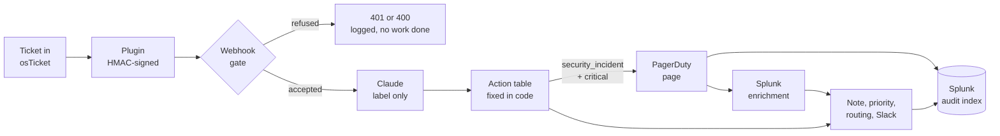

# osTicket AI Triage Agent

[](LICENSE)
[](https://github.com/umujalloh/osticket-triage-agent/actions/workflows/verify.yml)

**An AI triage layer for osTicket. Claude classifies incoming tickets, a fixed
action table decides what happens, and every decision is logged to Splunk. Real
security incidents stop getting buried in helpdesk noise.**

Built by Umu Jalloh · CompTIA Security+, Network+, AWS Solutions Architect – Associate · Cybersecurity and Computer Forensics, Stark State College

---

## What this is

Helpdesk queues mix routine IT requests with early signals of real security
incidents. A compromised account or a phishing report can sit unread behind
printer tickets.

This agent triages every ticket as it arrives. It classifies the ticket for
security relevance, enriches the serious ones with context from the SIEM, writes
an internal note back to the ticket, sets its priority, routes it, alerts Slack,
and pages PagerDuty on every critical security incident. A human opens a ticket
that has already been triaged.

Claude only ever produces a label. It never writes, never generates a query, and
never selects an action. A fixed table in code maps a classification to an
action, so a manipulated classification cannot trigger something that was not
pre-approved.

---

## Architecture


```mermaid
flowchart LR
    A[Ticket in<br/>osTicket] --> B[Plugin<br/>HMAC-signed]
    B --> C{Webhook<br/>gate}
    C -->|refused| X[401 or 400<br/>logged, no work done]
    C -->|accepted| D[Claude<br/>label only]
    D --> E[Action table<br/>fixed in code]
    E -->|security_incident<br/>+ critical| P[PagerDuty<br/>page]
    P --> I[Splunk<br/>enrichment]
    I --> F[Note, priority,<br/>routing, Slack]
    E --> F
    P --> G[(Splunk<br/>audit index)]
    F --> G
```

Every action starts at the table.

---

## How it works

A user submits a ticket in osTicket. The
[plugin](osticket-plugin/class.TriagePlugin.php) fires on ticket creation, signs
the payload with HMAC-SHA256, and POSTs it to the agent.
[`main.py`](agent/main.py) verifies the signature against the raw request body
and rejects anything that fails, along with anything replayed or already seen. It
returns `202` as soon as those checks pass and runs the work in a background
task, so a slow or rate-limited Claude call cannot hang the request osTicket is
waiting on.

[`classifier.py`](agent/classifier.py) sends the ticket text to Claude as
user-role content wrapped in delimiters, with the classification instructions in
the system role. Claude returns a category, severity, and confidence, constrained
by a tool schema at the API layer and validated again against the Pydantic model
in [`schemas.py`](agent/schemas.py), so a hostname or username the API accepted
but the agent will not allow fails here rather than downstream.

That classification is the last thing Claude contributes.
[`action_table.py`](agent/action_table.py) maps category, severity and confidence
to a set of actions. Ten rows, documented in
[docs/action-table.md](docs/action-table.md), covering every combination of the
three, and the table is the contract between what the classifier says and what
the agent does.

[`splunk_enrichment.py`](agent/splunk_enrichment.py) searches Splunk for related
events when the table selects enrichment, on `security_incident` at `critical`
severity. Confidence does not gate this, because the tickets that read as
uncertain are the ones a reviewer most needs context for.

[`note_builder.py`](agent/note_builder.py) builds the internal note, carrying the
enrichment result when there was one.
[`osticket_client.py`](agent/osticket_client.py) writes it back, sets the ticket
priority from the severity, and moves security questions to the security
department. It writes through
[`class.TriageWriteController.php`](osticket-plugin/class.TriageWriteController.php),
an endpoint the plugin registers, because osTicket's stock API can create a
ticket and trigger cron and nothing else. The note is an internal thread entry,
so the person who filed the ticket never sees it.

[`slack_client.py`](agent/slack_client.py) posts the alert to one of three
channels, `urgent` for critical security incidents, `incidents` for the high,
medium and low ones, and `review` for `unclear` tickets and the security
questions and IT requests it was not confident about.
[`pagerduty_client.py`](agent/pagerduty_client.py) pages one of two services,
WAKE to interrupt someone and NOTIFY to create an incident somebody owns without
waking them. Neither module chooses where its message goes.
The channel and the page destination are columns of the action table, selected
the same way the note and the priority are.

On a critical security incident the page goes out immediately, ahead of
enrichment and any audit write. Both of those talk to Splunk, and a Splunk that
hangs rather than refuses would otherwise hold the page for over two minutes.

[`splunk_logger.py`](agent/splunk_logger.py) writes an audit event for the
classification, the enrichment result, every action taken, and every request the
gate refused. The index is what lets someone reconstruct how a ticket was handled
without trusting the systems it passed through.

Two modules sit between a decision and a write.
[`idempotency.py`](agent/idempotency.py) records every completed action in a
SQLite store that survives a restart, so a retried webhook cannot write a second
note or send a second page. [`writes.py`](agent/writes.py) reads `ENABLE_WRITES`
once at import and exposes the single check every write path calls. It has no
default and accepts only `true` or `false`, so a misspelled value stops the agent
at boot instead of reading as off. Audit logging is never disabled by it.

---

## The trust boundary

Ticket text is written by whoever filed the ticket, which on an open form is
anyone on the internet. Claude reads it, the classifier extracts entities from
it, enrichment would search on those entities if allowed to, and a Slack alert
would carry it into a trusted channel if nothing stopped it. Four rules govern
how far it gets.

**Untrusted input stays in the user role.** Ticket subject and body are wrapped
in delimiters and sent as user-role content, with the classification instructions
in the system role. The model is never handed a prompt with submitter text
spliced into its instructions.

**Claude may produce a label and nothing else.** It never writes, never generates
a query, and never selects an action. The response is constrained twice, once by
the tool schema and once by the application's own model, and a response that
fails either is a failure rather than a classification.

**Only server-observed values may be searched.** Enrichment queries the
submitter's IP, which the server observes, and the requester email only when
osTicket reports the ticket was filed from an authenticated session for that
address. On an open form the email is whatever the submitter typed, so an
unverified one is a search target the submitter chose, and it never reaches a
query. Two tickets from the same address, one signed in and one not, are
compared in
[docs/verification.md](docs/verification.md#authentication-gate-verification).

Any hostname, username, or IP the classifier extracted from ticket text is
treated the same way. **Validated, recorded in the audit log, never searched
for.** An extracted entity is a value an attacker wrote, and searching on it
hands the attacker the search. Every value is validated against a strict pattern
inside the enrichment module, independent of whether the caller already validated
it.

Queries are fixed templates run under least privilege. No SPL is generated. The
enrichment user is scoped to a single index with no admin, write, or real-time
search capability. Results come back as a named field list rather than raw
events, so credentials sitting in raw log text never enter the audit index.

**Nothing the submitter wrote leaves the trust zone.** Every field in a Slack
alert or a PagerDuty page is one the agent generated. Severity, category, ticket
number, an enrichment count, and a link.

Three exclusions are deliberate:

- **The ticket subject**, because Slack renders a bare URL as a clickable link. A
  subject would let anyone who can file a ticket plant a link in a trusted
  channel under the agent's name.
- **The requester's address**, because it is personal data the ticket already
  holds inside the zone.
- **Enrichment results**, because they reveal what this organisation detects and
  with what tooling.

That is a rule rather than a judgement made field by field, so adding a field
later is a decision about the rule.

---

## When things fail

A triage system is most dangerous when it fails silently. A ticket that was never
classified looks exactly like a ticket classified as routine, and both look like
an empty queue. Every failure path below ends somewhere a human can see, on the
ticket, in a channel, or in the audit index.

**Claude fails.** Rate limited, unreachable, a bad credential, or an invalid
response. The agent posts the ticket number and the failure type to the review
channel and logs it to Splunk. It never constructs a placeholder classification.
There is no classification to act on and it will not invent one. The six failure
categories and what each one retries are in
[architecture.md, Section 6](docs/architecture.md#6-failure-modes-for-the-claude-dependency).

**The audit write fails.** If the classification never reached Splunk, nothing
outside the ticket explains how it was labelled, so the agent writes that gap
onto the note. If an action never reached Splunk, the action still happened and
left its own evidence, a note on the ticket or a message in Slack, so the agent
prints it to the console instead.

**Splunk enrichment fails.** The ticket still gets its note, its priority and its
alert. The note and the alert each report one of four outcomes:

- **`not_eligible`**, the ticket was never a critical security incident, so no
  line appears at all
- **`completed`**, which reads as `20 related events` or `no related events`
- **`no verified identifier`**, meaning there was nothing safe to search on
- **`enrichment unavailable`**, meaning Splunk could not be reached

Searching and finding nothing, and never searching at all, mean opposite things.
Four states exist so that those two can never be read as the same one.

**The agent is down.** osTicket queues the send in its own table and retries on
cron and on the next ticket created. After a configurable window, one hour by
default, it gives up and says so on the ticket. There is one status note per
ticket, rewritten in place, so two notes can never disagree.

**The agent crashes mid-ticket.** On restart it finishes what it accepted,
working from the decision it already made rather than reclassifying. osTicket was
already told the ticket arrived and will never send it again, so nothing else can
recover it. Anything older than an hour is handed to a person instead, because
paging about an incident from hours ago is worse than a note asking someone to
look.

**The agent stops entirely.** It writes a liveness event to Splunk every minute.
Three saved searches ship with the repo and alert by email when those events
stop, when pages keep failing to a destination, and when Slack posts do.

---

## A triaged ticket

One ticket, submitted through the osTicket form by a signed-in user reporting an
account they could not lock an intruder out of. It classified
`security_incident / critical / high_confidence`, which writes a note, sets
priority, alerts the urgent channel with a mention, and pages someone awake.

**On the ticket.** An internal note, invisible to the person who filed it,
carrying twenty related events grouped into sign-in outcomes, addresses, accounts
and applications. The last line is the query that produced them, built only from
values the server could verify, never from the ticket text.


**In Slack.** The alert to the urgent channel. Severity, category, ticket number,
confidence, page destination, event count, and a link. No subject, no requester
address, no enrichment detail, because none of those may leave the trust zone.


**In the audit index.** Every step recorded, and the page landing first, ahead of
enrichment and ahead of the audit writes.


---

## Verification

| | |
|---|---|
| Offline checks | **181** across 7 verifiers |
| Checks against a live stack | **84** across 3 verifiers |
| Real tickets used in live runs | **16** |

Full method and results in [docs/verification.md](docs/verification.md). The
verifiers are in [`agent/verification/`](agent/verification/) and each one is
reproducible from a single command.

Fourteen defects are recorded across those runs and verifiers. Six were found
only by running real tickets through a real stack, and no unit test would have
caught them, because none of them lives in the code a unit test calls.

| Found by | Example |
|---|---|
| Live runs on a real stack | The agent was bound to `127.0.0.1`, so the osTicket container could never reach it. Tickets were silently never triaged. |
| Pressure-testing the store | A failed store write left the in-flight mark set, locking that ticket out of every later delivery for the life of the process. |
| Walking every action-table row | The fallback page tested severity alone, so an `it_support` ticket rated critical would have paged the security on-call. |

What the verifiers cannot reach is in
[docs/known-limitations.md](docs/known-limitations.md), including why this lab
cannot demonstrate a real interrupting page.

---

## Classifier evaluation

Scored against 36 hand-written tickets with expected labels in
[tests/eval_tickets.json](tests/eval_tickets.json).
[`run_eval.py`](agent/run_eval.py) sends each ticket's subject and message to the
classifier and compares the result against the expected label. Expected labels
are never sent to the model, and classification and entity extraction are scored
separately so a regression in one cannot hide behind the other.

| Metric | Result |
|---|---|
| Category | 36 of 36 |
| Full label | 34 of 36 |
| Entity extraction | 36 of 36 |
| Unstable tickets across nine runs | 0 |
| Danger criterion | **0 failures in 180 classifications** |

The danger criterion counts only the failures that would leave a real incident
unalerted, ignoring disagreements that would not. Method and current results in
[docs/evaluation.md](docs/evaluation.md).

The score is a regression detector, not an estimate of real-world accuracy. What
the evaluation cannot tell you is in
[docs/known-limitations.md](docs/known-limitations.md).

---

## Repository layout

```
agent/                  FastAPI service: webhook, classifier, enrichment, actions, audit
agent/verification/     10 verifiers, 265 checks, each reproducible from one command
docker/                 Dockerfile, compose file, Splunk provisioning and saved searches
docs/                   Architecture, action table, evaluation, verification, limitations, setup
osticket-plugin/        osTicket plugin: signing, delivery, retry queue, status note
tests/                  Labelled ticket set for the classifier evaluation
```

---

## Documentation

- [Architecture](docs/architecture.md) — design, threat model, trust boundaries
- [Action table](docs/action-table.md) — the contract between classification and action
- [Verification](docs/verification.md) — what the built system was checked to do
- [Evaluation](docs/evaluation.md) — how the classifier is measured and what it scores
- [Known limitations](docs/known-limitations.md) — what this build cannot do
- [Setup](docs/setup.md) — running the whole stack yourself, from an empty
  directory to a triaged ticket

---

## Deployment preconditions

Four things the agent cannot enforce and the design depends on. Nothing looks
broken when they are missing, which is what makes them worth checking. Reasoning
in [architecture.md, Section 10](docs/architecture.md#10-deployment-preconditions).

- **A security department in osTicket** an agent can actually see, or routed
  tickets vanish from every view while the agent reports success.
- **Notifications enabled on the urgent Slack channel.** The agent cannot set
  them and cannot detect that they are unset. The same holds for PagerDuty.
- **Something outside the agent watching the audit index**, since the agent
  cannot raise an alarm that its own audit trail has stopped.
- **CAPTCHA enabled and client registration set deliberately**, or anyone can
  submit unlimited tickets and bury a real incident under noise.

