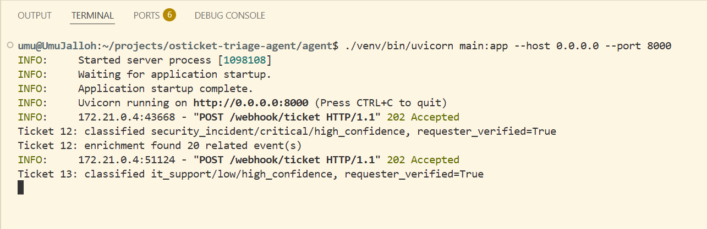
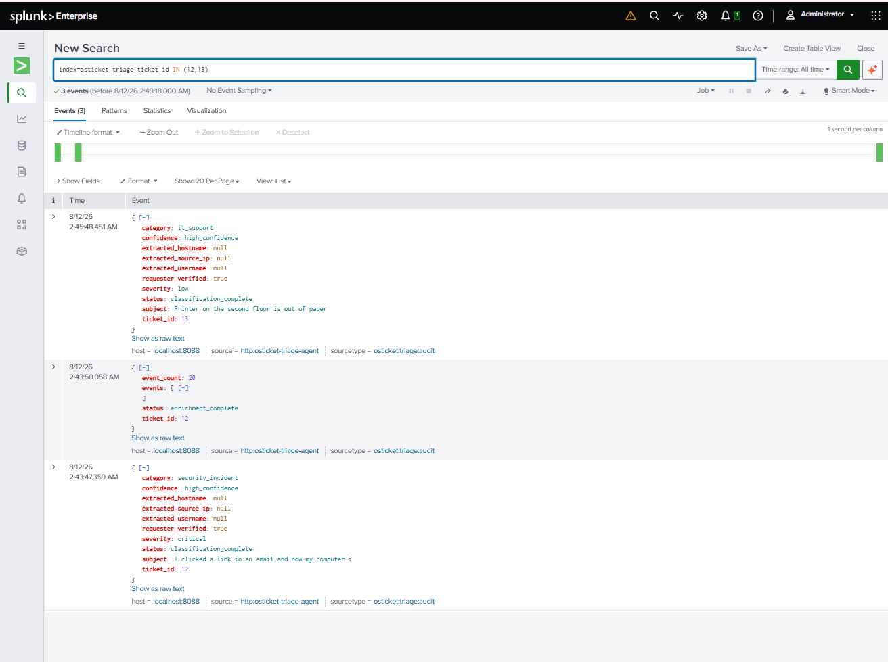
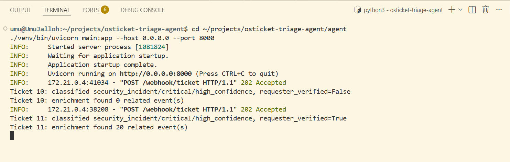

# osTicket AI Triage Agent

An AI triage layer for osTicket helpdesk tickets. Classifies incoming tickets
for security relevance, enriches them with Splunk data, and routes them to the
right place. Real security incidents stop getting buried in helpdesk noise.

## Status

Phases 1 and 2 complete. Tickets are received over an authenticated webhook,
classified, enriched with Splunk context when the gate matches, and written to a
Splunk audit log. No writes back to osTicket yet: internal notes, alerting, and
paging are Phase 3.

See [docs/architecture.md](docs/architecture.md) for the design and threat
model, [docs/TESTING.md](docs/TESTING.md) for how the agent is tested and what
it currently scores, and
[docs/KNOWN_LIMITATIONS.md](docs/KNOWN_LIMITATIONS.md) for what it cannot do.

## Why this exists

Helpdesk queues mix routine IT requests with early signals of real security
incidents. A compromised account or a phishing report can sit unread behind
printer tickets. This agent triages every ticket as it arrives, flags the
security-relevant ones, and enriches them with context from the SIEM before a
human ever looks.

## How it works

A user submits a ticket in osTicket. The
[plugin](osticket-plugin/class.TriagePlugin.php) fires on ticket creation, signs
the payload with HMAC-SHA256, and POSTs it to the agent.
[`main.py`](agent/main.py) verifies the signature against the raw request body
and rejects anything that fails.

[`classifier.py`](agent/classifier.py) sends the ticket text to Claude as
user-role content wrapped in delimiters, with the classification instructions in
the system role. Claude returns a category, severity, and confidence,
constrained by a tool schema and validated against the Pydantic model in
[`schemas.py`](agent/schemas.py). [`splunk_logger.py`](agent/splunk_logger.py)
writes the result to Splunk over HEC.

When a ticket lands on `security_incident` at `critical` severity,
[`splunk_enrichment.py`](agent/splunk_enrichment.py) searches Splunk for related
events. Confidence does not gate this, because the tickets that read as
uncertain are the ones a reviewer most needs context for.

It searches on the submitter's IP, which the server observes, and on the
requester email only when osTicket reports the ticket was filed from an
authenticated session for that address. On an open ticket form the email is
whatever the submitter typed, so an unverified one is a search target the
submitter picked and never reaches a query. Any hostname, username, or IP the
classifier extracted from the ticket text is treated the same way: validated and
recorded in the audit log, never searched for. Every value is validated against a
strict pattern inside the enrichment module before it can reach a query,
independent of whether the caller already validated it.

Queries are built from fixed templates, run read-only, authenticate as a Splunk
user scoped to a single index, and return a named field list rather than raw
events, so credentials sitting in raw log text never enter the audit index. The
result, or the reason there wasn't one, goes to the audit log either way.

If Claude fails to return a classification, rate limited, unreachable, a bad
credential, or an invalid response, the agent flags the ticket for human review
and logs the specific failure type to Splunk instead of guessing at a
classification. Until Phase 3 lands write-back, flagging means a line in the
agent's output and an audit event in Splunk; the ticket itself stays in
osTicket's normal queue. The same applies when the audit write fails, since a
decision with no audit trail cannot be trusted to have been recorded. The full
breakdown is in
[docs/architecture.md](docs/architecture.md#6-failure-modes-for-the-claude-dependency).

Claude only ever produces a label. Every action the agent takes comes from a
fixed table in code ([docs/action-table.md](docs/action-table.md)), so a
manipulated classification cannot trigger an action that was not pre-approved.

## Example

Two tickets submitted through osTicket, a reported phishing click and a printer
out of paper, classified and audited:





The same ticket filed twice with the same requester address, once as a guest and
once signed in as that address. The classification is identical both times. The
only difference is whether the agent was allowed to search that address, and
what that difference produced:




Method and full results for that pair, including why an account-status check
would not have been enough, are in
[docs/TESTING.md](docs/TESTING.md#authentication-gate-verification).

## Repository layout

```
agent/              FastAPI service: webhook receiver, classifier, enrichment, audit logger
docker/             Dockerfile, compose file, and Splunk provisioning for the environment
docs/               Architecture, action table, testing, known limitations
osticket-plugin/    osTicket plugin that fires the webhook
tests/              Evaluation ticket set
```

## Setup

### Prerequisites

- Docker and Docker Compose
- Python 3.11 or newer (developed and tested on 3.14)
- An Anthropic API key

### 1. osTicket environment

```bash
cd docker
cp .env.example .env
```

Edit `docker/.env` and set your own database credentials. These exact values
are used again during the osTicket installer, so keep them to hand.

The Dockerfile removes osTicket's `setup/` directory, which is a live
installer page and a liability once osTicket is installed. That directory has
to exist for the first install, so the first build is done with that line
commented out.

Comment out this two-line instruction in [docker/Dockerfile](docker/Dockerfile),
the one that removes `setup/` and chowns the plugin directory:

```dockerfile
# RUN rm -rf /var/www/html/setup \
#     && chown -R www-data:www-data /var/www/html/include/plugins/triage-webhook
```

Then build the image and create the config file:

```bash
docker compose build osticket
docker compose run --rm --no-deps --entrypoint cat osticket \
  /var/www/html/include/ost-sampleconfig.php > ost-config.php
chmod 0666 ost-config.php
```

[docker/docker-compose.yml](docker/docker-compose.yml) mounts `ost-config.php`
into the container so the install survives a rebuild. Docker creates that path
as a directory if the file does not exist yet, which leaves the installer with
nowhere to write, so it has to be copied out of the image first.

Start the stack:

```bash
docker compose up -d --build
```

Open `http://localhost:8080` and run the installer. Use `db` as the MySQL
hostname, since that is the service name on the Docker network. The database
name, user, and password must match what you set in `docker/.env`.

Once the installer finishes, uncomment both lines and rebuild:

```bash
docker compose up -d --build
```

`ost-config.php` holds the database credentials and osTicket's secret salt, so
it is not committed. Each install generates its own. Only the installer needs it
writable, so tighten it back down now that the install is finished:

```bash
chmod 0644 ost-config.php
```

### 2. Plugin configuration

The plugin files are copied into the image by the Dockerfile, so osTicket will
already see the plugin. The instance still has to be created by hand.

Generate a shared secret. Python's standard library covers this, no project
setup needed yet:

```bash
python3 -c "import secrets; print(secrets.token_hex(32))"
```

Save the output, this value goes into `agent/.env` in Section 4 as well.

Log into the staff panel at `http://localhost:8080/scp`, then Manage →
Plugins. Open AI Triage Webhook and set it to Active. Add an instance, give it
a name, set its status to Active, and on the Config tab set:

- FastAPI Webhook URL: `http://host.docker.internal:8000/webhook/ticket`
- HMAC Shared Secret: the value you just generated

The container reaches the agent through `host.docker.internal`, which resolves
via the `extra_hosts` entry in
[docker-compose.yml](docker/docker-compose.yml). The agent must be listening
on port 8000 on the host.

### 3. Splunk

Splunk runs as part of the same Docker Compose stack and already started in
Section 1. Set `SPLUNK_PASSWORD` in `docker/.env` (8 or more characters,
mixing letters and numbers, Splunk rejects overly simple passwords even at
8 characters).

The agent verifies its TLS connection to Splunk against a certificate
generated for this deployment, not Splunk's shipped default (the same
certificate and private key ship in every default Splunk install, so
trusting it wouldn't prove anything). Run `docker/generate-splunk-cert.sh`
now, before starting Splunk - docker-compose.yml points Splunk at this
certificate from its first boot, so it needs to exist beforehand. The
output is gitignored and not committed. See
[`splunk_logger.py`](agent/splunk_logger.py).

Enrichment searches the BOTSv3 dataset, which is not committed. Download the
BOTSv3 data set app and unpack it to `docker/splunk-apps/botsv3_data_set`, which
[docker-compose.yml](docker/docker-compose.yml) mounts into the container as a
Splunk app. Skipping this leaves the rest of the pipeline working; enrichment
simply returns no results.

Then run `docker compose up -d --build`.

Splunk's web UI is at `http://localhost:8010`, mapped from the container's
internal port 8000 since port 8000 is already used by the agent. Log in with
`admin` and the password you set.

Create an index named `osticket_triage`.

Confirm HEC is enabled globally: Settings → Data Inputs → HTTP Event Collector
→ Global Settings, All Tokens should show Enabled. This is usually already on
by default, but worth checking before creating a token.

Create an HEC token with the `osticket_triage` index in its allowed list. The
agent sends events with sourcetype `osticket:triage:audit`. Splunk shows the
token value once, at creation, save it now, this value goes into `agent/.env`
in Section 4.

Enrichment queries run as a separate read-only user, not as admin. Set
`SPLUNK_AGENT_PASSWORD` in `docker/.env`, then run
`docker/provision-splunk-user.sh`. It creates a `triage_agent` user in a
least-privilege role scoped to the `botsv3` index, with no admin, write, or
real-time search capability. The script is safe to re-run and skips a user that
already exists. This value goes into `agent/.env` in Section 4 as well.

Splunk must be running when the agent processes a ticket. If it is not, the
audit write fails and the agent prints a "needs human review" line for that
ticket, since a decision with no audit trail can't be trusted to have been
recorded correctly.

### 4. Agent environment

```bash
cd agent
python3 -m venv venv
source venv/bin/activate
pip install -r requirements.txt
```

Create `agent/.env`. [`agent/.env.example`](agent/.env.example) lists every
variable the agent reads, with the optional ones and their defaults:

```
ANTHROPIC_API_KEY=your-key
TRIAGE_HMAC_SECRET=the-secret-you-generated-in-section-2
SPLUNK_HEC_URL=https://localhost:8088/services/collector/event
SPLUNK_HEC_TOKEN=the-token-you-created-in-section-3
SPLUNK_SEARCH_URL=https://localhost:8089
SPLUNK_AGENT_PASSWORD=the-password-you-set-in-section-3
```

The first four are asserted at import time. A missing one refuses to boot rather
than starting in a degraded state. The two search variables are read by the
enrichment module.

`SPLUNK_ENRICHMENT_EARLIEST` defaults to `-7d`, which is the sensible window
against live telemetry. BOTSv3 is frozen in 2018 and 2019, so a relative window
can never reach it. Set `SPLUNK_ENRICHMENT_EARLIEST=0` to search all time
against the demo dataset.

### 5. Run the agent

```bash
cd agent
source venv/bin/activate
uvicorn main:app --reload --host 0.0.0.0 --port 8000
```

Submit a ticket at `http://localhost:8080`. The classification appears in the
agent's output and in Splunk under `index=osticket_triage`.

### 6. Deployment preconditions

Three things the agent cannot enforce and the design depends on. Reasoning in
[docs/architecture.md, Section 10](docs/architecture.md#10-deployment-preconditions).

- **A security-tagged queue in osTicket.** Without it, `security_question`
  tickets have nowhere to route.
- **Notifications enabled on the urgent Slack channel**, by whatever mechanism
  your workspace provides. The agent cannot set them and cannot detect that
  they are unset, so a critical alert can arrive in a channel nobody is
  notified about.
- **CAPTCHA enabled and client registration set deliberately** on the ticket
  form. An open form with neither lets anyone on the internet submit unlimited
  tickets, which is how a real incident gets buried under noise.

Nothing looks broken when these are missing, which is what makes them worth
checking.

## Evaluation

The classifier is evaluated against 36 hand-written tickets with expected
labels in [tests/eval_tickets.json](tests/eval_tickets.json):

```bash
cd agent
source venv/bin/activate
python3 run_eval.py
```

[`run_eval.py`](agent/run_eval.py) sends each ticket's subject and message to
the classifier and compares the result against the expected label. Expected
labels are never sent to the model. Classification and entity extraction are
scored separately so a regression in one cannot be hidden by the other.

Current results, the method behind them, and a second pass criterion that
measures only the failures which would leave a real incident unalerted are in
[docs/TESTING.md](docs/TESTING.md). What the evaluation cannot tell you is in
[docs/KNOWN_LIMITATIONS.md](docs/KNOWN_LIMITATIONS.md).
